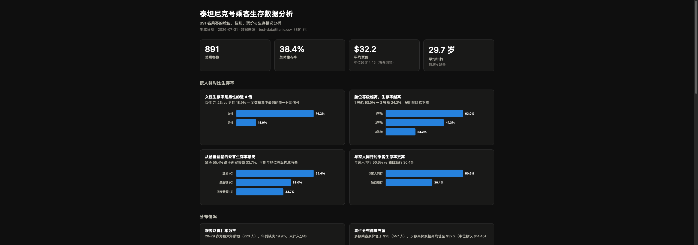
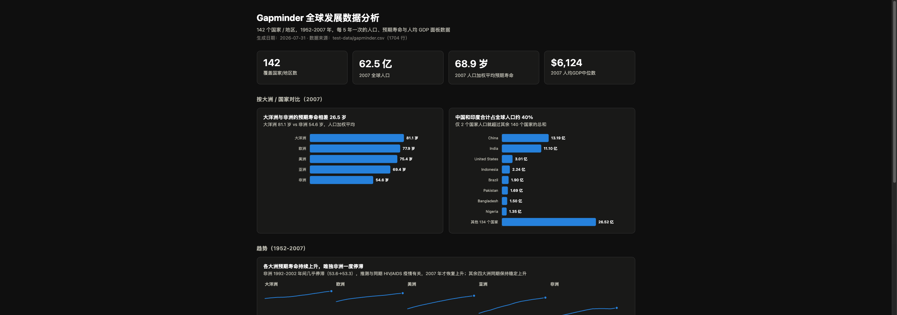

# DataVizKit

两个与厂商无关的 Agent Skills，用于把表格数据转换成清晰、无障碍的可视化和可离线打开的 HTML 报告。

[English](README.md) | [简体中文](README.zh-CN.md)



## 视频演示

20 秒了解 DataVizKit 如何把 CSV、XLSX 和 JSON 数据转换成专业报告。

[](docs/media/datavizkit-promo.mp4)

▶ **[观看或下载 MP4](docs/media/datavizkit-promo.mp4)**

## 效果示例

DataVizKit 会分析源数据、筛选有依据的发现，并生成响应式、自包含的 HTML 报告，其中包括 KPI 卡片、图表、注意事项和明细表格。



## 包含的 Skills

- **`dataviz`**：图表选择、颜色角色、无障碍、交互和可视化反模式。
- **`data-report`**：分析 CSV、TSV、JSON records、基础 XLSX 工作簿、粘贴的表格，以及从数据库导出的查询结果，并生成报告。

这两个 Skills 使用通用的 `SKILL.md` 约定，不需要专有 Artifact 运行时、CDN、付费 API 或外部分析服务。

## 兼容性

可用于 Claude Code、Codex、Cursor、Gemini CLI、OpenClaw，以及其他能够读取 Markdown 并运行 Python 3 的编程 Agent。不同产品的 Skill 自动发现机制并不相同；如果无法自动发现，可以让 Agent 直接读取对应的 `SKILL.md`。

## 让 AI Agent 直接安装

把下面这段提示词发给 Claude Code、Codex、Cursor、Gemini CLI、OpenClaw 或其他编程 Agent：

```text
请从 https://github.com/CodingPro777/dataviz-kit 安装 DataVizKit Agent Skills。

请自动识别当前 Agent 正确的 Skills 目录，克隆或下载仓库，安装
skills/dataviz 和 skills/data-report，保留完整目录结构，并验证两个
SKILL.md 都能被发现。不要安装付费服务或无关依赖。完成后告诉我
最终安装路径和验证结果。
```

Agent 应根据自身约定，把两个 Skills 安装到合适的全局或项目级 Skills 目录。如果当前 Agent 只在启动时刷新 Skill 索引，安装后请重新启动或重新加载。

### 手动安装备用方案

如果 Agent 无法自行安装，可以克隆仓库，再把两个目录复制到该 Agent 文档指定的 Skills 目录：

```bash
git clone https://github.com/CodingPro777/dataviz-kit.git
cd dataviz-kit
cp -R skills/dataviz /path/to/agent/skills/
cp -R skills/data-report /path/to/agent/skills/
```

`data-report` 在规划和渲染图表时会使用 `dataviz`，因此建议同时安装。

## 使用方法

示例请求：

- “分析这份 CSV，先给我图表计划，再创建离线 HTML 报告。”
- “分析这个 XLSX 工作簿，找出最有依据的洞察。”
- “把这些 SQL 查询导出结果转换成无障碍 dashboard。”
- “为这份表格选择合适的图表，并生成离线 HTML 报告。”

也可以直接运行数据分析脚本：

```bash
python3 skills/data-report/scripts/profile_data.py path/to/data.csv
```

分析脚本只使用 Python 标准库。XLSX 支持面向普通的单元格工作簿，并读取第一个工作表；不支持宏、需要重新计算的公式、图表、数据透视缓存、加密文件和旧版 `.xls` 文件。

## 测试

```bash
python3 -m unittest discover -s tests -v
```

测试覆盖 CSV、TSV、JSON、XLSX、格式错误的输入、Python 编译，以及有效的 Skill frontmatter。

## 数据库安全

报告 Skill 可以处理数据库查询导出文件或结果表，但不会自动连接线上数据库，也不会保存凭据。任何线上连接都应单独获得用户授权，并使用宿主 Agent 认可的密钥管理方式。

## License

MIT。本重写版本为原创内容，不包含之前的 Anthropic `dataviz` 副本。
